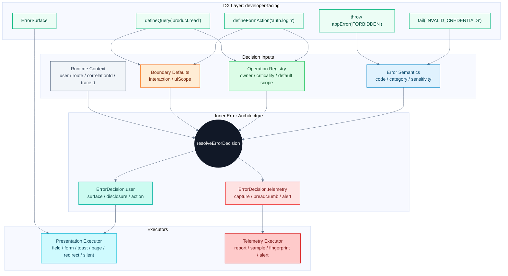
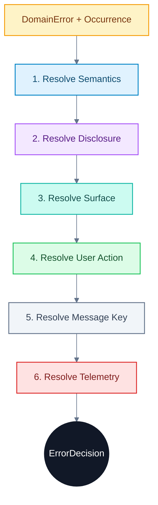
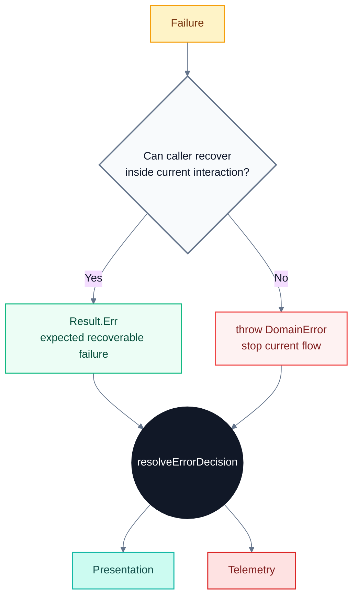

# Error Decision System

이 문서는 제품 수준의 에러 처리 시스템을 새로 설계하기 위한 상위 아키텍처 문서다.

기존의 질문은 단순했다.

```txt
의도한 에러인가?
의도하지 않은 에러인가?
Result로 반환할 것인가?
throw할 것인가?
사용자에게 보여줄 것인가?
로깅할 것인가?
```

하지만 프로덕션 제품에서는 이 질문만으로 충분하지 않다.

의도한 에러라고 해서 항상 구체적으로 보여주면 안 된다. `INVALID_CREDENTIALS`처럼 사용자가 행동할 수 있는 business failure라도 보안상 원인을 흐려야 한다.

의도하지 않은 에러라고 해서 항상 "서버 에러"로 뭉개는 것도 부족하다. 내부 원인은 숨기더라도 사용자가 다시 시도할 수 있는지, 문의해야 하는지, 그냥 기다려야 하는지는 알려줘야 한다.

또한 에러 처리는 사용자 메시지의 문제가 아니다. 같은 실패라도 검색 결과 없음, 상세 페이지 접근 실패, 결제 실패, 백그라운드 prefetch 실패는 완전히 다른 UI와 운영 신호를 가져야 한다.

마지막으로, 개발자가 사용하기 어려운 시스템은 오래 유지되지 않는다. 아무리 정책적으로 정교해도 호출부마다 `occurrence`, `disclosure`, `surface`, `telemetry`, `criticality`를 수동으로 넘겨야 한다면 결국 우회 코드가 생긴다.

따라서 이 문서의 핵심 명제는 다음이다.

> 에러 처리는 예외를 잡는 일이 아니라, 실패한 사용자 작업에 대해 사용자 경험과 운영 신호를 결정하는 일이다. 그리고 그 결정 시스템은 개발자가 매일 쓰기 쉬워야 한다.

## 시스템 정의

이 시스템의 이름은 **Error Decision System**이다.

목표는 에러를 단순히 분류하는 것이 아니다. 특정 사용자 작업이 실패했을 때 다음 두 질문에 일관되게 답하는 것이다.

```txt
User question:
  지금 무엇이 막혔고, 내가 무엇을 할 수 있는가?

Operator question:
  이 실패는 기록해야 하는가, 묶어야 하는가, 사람을 깨워야 하는가?
```

이를 위해 시스템은 두 계층으로 나뉜다.

```txt
Inner Error Architecture
  정책적으로 올바른 ErrorDecision을 만든다.

DX Layer
  개발자가 그 정책을 얇고 안전한 API로 사용하게 한다.
```

`Inner Error Architecture`만 있으면 정확하지만 무거운 policy engine이 된다.

`DX Layer`만 있으면 API는 예쁘지만 내부 결정 기준이 빈약한 wrapper가 된다.

둘이 합쳐져야 유지보수 가능한 에러 처리 시스템이 된다.

## 전체 구조



## 핵심 원칙

### 1. 에러 코드는 최종 결정을 하지 않는다

에러 코드는 실패의 본질을 말한다. 하지만 사용자 표현과 로깅 정책을 단독으로 결정하지 못한다.

`NOT_FOUND`는 검색 화면에서는 empty state일 수 있고, 상세 페이지에서는 404 page일 수 있으며, 권한을 숨기는 상황에서는 generic 404일 수 있다.

### 2. Operation이 제품 맥락을 제공한다

`TIMEOUT`만으로는 중요한 실패인지 알 수 없다.

`checkout.pay + TIMEOUT`은 revenue-critical failure다.

`profile.prefetch + TIMEOUT`은 낮은 중요도의 background failure일 수 있다.

따라서 개발자는 에러마다 정책을 쓰는 대신 operation을 선언해야 한다.

### 3. Boundary가 사건 맥락을 채운다

개발자가 `interaction: "form-submit"` 같은 값을 매번 쓰면 안 된다.

`defineFormAction()`은 form submit이라는 사실을 안다.

`defineQuery()`는 query라는 사실을 안다.

`defineBackgroundTask()`는 background sync라는 사실을 안다.

### 4. ErrorDecision은 사용자와 운영을 분리한다

사용자에게 field error를 보여주지만 capture하지 않을 수 있다.

사용자에게 아무것도 보여주지 않지만 내부 breadcrumb를 남길 수 있다.

따라서 decision은 최소한 두 부분으로 나뉘어야 한다.

```ts
interface ErrorDecision {
  user: UserErrorDecision;
  telemetry: TelemetryDecision;
}
```

### 5. DX는 얇아야 한다

개발자가 매일 기억해야 하는 것은 세 가지면 충분하다.

```txt
1. 어떤 operation인가?
2. 어떤 error code인가?
3. Result로 회복할 수 있는가, throw로 중단해야 하는가?
```

나머지 `surface`, `disclosure`, `telemetry`, `supportCode`, `sampling`, `alert`는 시스템이 결정해야 한다.

## Inner Error Architecture

Inner Architecture는 정책적으로 올바른 결정을 만드는 계층이다.

입력은 다음이다.

```txt
error semantics
+ occurrence context
+ user actionability
+ UI impact scope
+ disclosure/security policy
+ operational/business criticality
+ runtime context
= error decision
```

### Error Semantics

Semantics는 에러의 본질이다.

```ts
type ErrorCategory = "business" | "operational" | "fault";

type ErrorSensitivity =
  | "public"
  | "auth"
  | "permission"
  | "pii"
  | "business-sensitive"
  | "internal";

interface ErrorSemantics {
  code: string;
  category: ErrorCategory;
  sensitivity: ErrorSensitivity;
  defaultHttpStatus: number;
  defaultRetryable: boolean;
  defaultMessageKey: string;
  messageKeys?: Partial<Record<DisclosureLevel, string>>;
  disclosureByUiScope?: Partial<Record<UiScope, DisclosureLevel>>;
  disclosureByResource?: Partial<Record<string, DisclosureLevel>>;
  defaultAction?: UserAction;
  actionByUiScope?: Partial<Record<UiScope, UserAction>>;
  actionByInteraction?: Partial<Record<InteractionKind, UserAction>>;
  actionByResource?: Partial<Record<string, UserAction>>;
  surfaceByResource?: Partial<Record<string, ErrorSurface>>;
  telemetryBySurface?: Partial<Record<ErrorSurface, Partial<TelemetryDecision>>>;
  detailsExposure: "none" | "allowlist";
  detailsAllowlist?: readonly string[];
}
```

Semantics가 알아야 하는 것:

- 어떤 실패인가
- 보안상 민감한가
- 기본 HTTP status는 무엇인가
- details를 공개할 수 있는가
- 기본 message key는 무엇인가
- disclosure 수준별로 어떤 message key를 써야 하는가
- 특정 resource/scope에서 기본 action 또는 surface가 달라지는가

Semantics가 직접 결정하지 않아야 하는 것:

- 최종 UI surface
- 최종 log level
- alert 여부
- 특정 React component
- 특정 화면의 field mapping

단, semantics는 resolver가 code 문자열을 하드코딩하지 않도록 decision hint를 가질 수 있다. 예를 들어 `AUTH_REQUIRED`가 기본적으로 `login` action을 갖거나, `NOT_FOUND + resource: "collection"`이 `empty` surface를 갖는다는 사실은 resolver 코드의 `if (code === "...")`보다 registry data에 두는 편이 낫다.

### Occurrence Context

Occurrence는 에러가 발생한 사건의 맥락이다.

```ts
type InteractionKind =
  | "page-load"
  | "query"
  | "mutation"
  | "form-submit"
  | "background-sync"
  | "route-guard"
  | "event-handler"
  | "render";

type UiScope =
  | "field"
  | "form"
  | "component"
  | "panel"
  | "page"
  | "session"
  | "background";

type Criticality = "low" | "normal" | "core" | "revenue" | "security";

interface OccurrenceContext {
  operation: string;
  interaction: InteractionKind;
  uiScope: UiScope;
  criticality: Criticality;
  fieldPath?: string;
  resource?: string;
  userCanRetry?: boolean;
  idempotent?: boolean;
  background?: boolean;
}
```

### Disclosure Policy

Disclosure는 사용자에게 어느 정도까지 공개할 수 있는지를 정한다.

```ts
type DisclosureLevel =
  | "specific"
  | "safe-vague"
  | "generic"
  | "support-only";
```

| sensitivity | 기본 disclosure | 이유 |
|---|---|---|
| `public` | `specific` | 공개해도 공격 표면이 작음 |
| `auth` | `safe-vague` | 계정 존재 여부와 인증 원인 노출 방지 |
| `permission` | `safe-vague` | 권한 모델과 리소스 존재 여부 노출 방지 |
| `pii` | `safe-vague` 또는 `support-only` | 개인정보 노출 방지 |
| `business-sensitive` | `safe-vague` | 가격, 정책, 심사 사유 보호 |
| `internal` | `generic` 또는 `support-only` | 내부 구현 정보 보호 |

Disclosure는 message selection을 강제해야 한다.

```ts
const messageKey =
  semantics.messageKeys?.[decision.disclosure] ??
  semantics.defaultMessageKey;
```

`safe-vague`나 `support-only`를 결정했는데도 민감한 `defaultMessageKey`를 그대로 쓰면 disclosure policy는 권고에 그친다. 안전한 copy는 registry 또는 localization layer에서 구조적으로 선택되어야 한다.

### User Actionability

Actionability는 사용자가 지금 할 수 있는 행동이다.

```ts
type UserAction =
  | "fix-input"
  | "retry"
  | "login"
  | "request-access"
  | "choose-different-option"
  | "wait"
  | "go-back"
  | "contact-support"
  | "none";
```

메시지는 원인 설명보다 다음 행동을 우선해야 한다.

### UI Surface

Surface는 에러 종류가 아니라 UI 손상 범위와 회복 위치로 정한다.

```ts
type ErrorSurface =
  | "field"
  | "form"
  | "inline"
  | "empty"
  | "toast"
  | "dialog"
  | "page"
  | "redirect"
  | "silent";
```

| surface | 쓰는 경우 |
|---|---|
| `field` | 특정 입력을 고치면 해결 |
| `form` | 폼 전체 상태를 고쳐야 함 |
| `inline` | 특정 컴포넌트만 실패 |
| `empty` | 실패가 비어 있음 상태와 같음 |
| `toast` | 화면은 유지하고 일시적으로 알림 |
| `dialog` | 사용자 선택이 필요 |
| `page` | 페이지를 계속 사용할 수 없음 |
| `redirect` | 다른 경로가 회복 경로 |
| `silent` | 보여주면 방해만 됨 |

### ErrorDecision

```ts
interface UserErrorDecision {
  surface: ErrorSurface;
  disclosure: DisclosureLevel;
  messageKey: string;
  action: UserAction;
  target?: string;
  supportCode?: string;
  retryAfterMs?: number;
}

interface TelemetryDecision {
  capture: boolean;
  level: "info" | "warning" | "error" | "fatal";
  breadcrumb: boolean;
  alert: boolean;
  sampleRate?: number;
  fingerprint?: readonly string[];
  tags?: Record<string, string>;
}

interface ErrorDecision {
  user: UserErrorDecision;
  telemetry: TelemetryDecision;
}
```

### Decision Pipeline



## DX Layer

DX Layer는 Inner Architecture를 개발자가 매일 쓰기 쉬운 API로 감싼다.

좋은 호출부는 이 정도여야 한다.

```ts
const login = defineFormAction("auth.login", async (input) => {
  const user = await authenticate(input);

  if (!user) {
    return fail("INVALID_CREDENTIALS");
  }

  return ok(user);
});
```

### Operation Registry

Operation Registry는 제품 작업의 맥락을 정의한다.

```ts
defineOperation("auth.login", {
  owner: "security",
  criticality: "security",
  defaultUiScope: "form",
});

defineOperation("checkout.pay", {
  owner: "payments",
  criticality: "revenue",
  defaultUiScope: "form",
});

defineOperation("profile.prefetch", {
  owner: "growth",
  criticality: "low",
  defaultUiScope: "background",
});
```

Error Registry는 실패의 본질을 정의한다.

Operation Registry는 제품 작업의 중요도와 기본 UI 맥락을 정의한다.

둘은 분리되어야 한다.

### Boundary Helpers

Boundary helper는 개발자가 사건 맥락을 반복해서 쓰지 않게 한다.

| Helper | 자동으로 채우는 context |
|---|---|
| `defineFormAction()` | `interaction: "form-submit"`, `uiScope: "form"` |
| `defineServerAction()` | `interaction: "mutation"`, `uiScope: "component"` |
| `defineQuery()` | `interaction: "query"`, `uiScope: "component"` |
| `defineRouteGuard()` | `interaction: "route-guard"`, `uiScope: "page"` |
| `defineBackgroundTask()` | `interaction: "background-sync"`, `uiScope: "background"` |
| `withRenderBoundary()` | `interaction: "render"`, `uiScope: "page"` |

Precedence는 명시적으로 정한다.

```txt
call-site occurrence override
  > boundary helper defaults
  > operation registry default
```

Boundary는 "이번 실패가 어떤 문에서 들어왔는가"를 설명한다. 따라서 background boundary가 `uiScope: "background"`를 채웠다면 operation registry의 `defaultUiScope: "form"`이 이를 조용히 덮으면 안 된다. Operation registry의 scope는 helper가 scope를 모를 때 쓰는 fallback이다.

### 80 / 15 / 5 API

API는 사용 빈도에 따라 나뉘어야 한다.

#### 80%: 기본 경로

```ts
return fail("VALIDATION", { fieldErrors });
return fail("INVALID_CREDENTIALS");
throw appError("AUTH_REQUIRED");
```

이 경로에서는 surface, disclosure, telemetry를 직접 넘기지 않는다.

#### 15%: 제한된 override

```ts
return fail("RATE_LIMITED", null, {
  retryAfterMs: 60_000,
});

return fail("PAYMENT_FAILED", details, {
  userCanRetry: false,
});
```

호출부가 실제로 알고 있는 일부 사실만 보강한다.

#### 5%: escape hatch

```ts
return fail("PAYMENT_PROVIDER_UNAVAILABLE", null, {
  occurrence: {
    criticality: "revenue",
    idempotent: false,
  },
  telemetry: {
    alert: false,
    fingerprint: ["checkout.pay", "provider-unavailable"],
  },
});
```

이 API는 드물어야 한다. 자주 쓰이면 DX 설계를 다시 봐야 한다.

## Result와 Throw

`Result` vs `throw`는 최종 UX 정책이 아니라 실패 전달 방식이다.



기준:

| 질문 | Result.Err | throw |
|---|---|---|
| 같은 화면에서 수정 가능한가? | 예 | 아니오 |
| 실패가 interaction의 정상 결과인가? | 예 | 보통 아니오 |
| 요청/렌더 흐름을 계속할 수 있는가? | 예 | 아니오 |
| Error Boundary나 route interrupt가 필요한가? | 아니오 | 예 |

중요한 점은 `Result`든 `throw`든 최종 표현은 `ErrorDecision`으로 결정한다는 것이다.

## 사용자 표현

UI는 `error.code`를 직접 해석하지 않아야 한다.

나쁜 UI:

```tsx
if (error.code === "VALIDATION") {
  return <FieldErrors error={error} />;
}

toast(error.message);
```

좋은 UI:

```tsx
return <ErrorSurface decision={decision} />;
```

또는:

```tsx
<ErrorSurface
  decision={decision}
  slots={{
    field: FieldError,
    form: FormBanner,
    empty: EmptyState,
    inline: InlineError,
    page: PageError,
  }}
/>
```

UI는 `surface`, `messageKey`, `action`, `target`, `supportCode`를 실행한다.

Raw `error.message`는 사용자에게 보여주지 않는다.

## 운영 신호

Telemetry도 에러 코드를 다시 해석하지 않는다.

```ts
function executeTelemetryDecision(
  error: DomainError,
  decision: TelemetryDecision,
  ctx: TelemetryContext,
) {
  const sampledIn =
    decision.sampleRate === undefined ||
    decision.sampleRate >= 1 ||
    Math.random() < decision.sampleRate;

  if (decision.capture && sampledIn) {
    reporter.capture(error, {
      level: decision.level,
      fingerprint: decision.fingerprint,
      tags: decision.tags,
      sampleRate: decision.sampleRate,
      ctx,
    });
  }

  if (decision.breadcrumb) {
    reporter.breadcrumb(error, ctx);
  }

  if (decision.alert) {
    notifier.alert(error, {
      level: decision.level,
      fingerprint: decision.fingerprint,
      ctx,
    });
  }
}
```

Sentry, console, pager adapter는 delivery 책임만 가진다.

Alert 판단은 adapter가 아니라 decision resolver가 끝낸다.

Sampling은 resolver가 `sampleRate`를 결정하고 executor 또는 reporter wrapper가 실행한다. 둘 중 어디서 실행하든 contract test가 있어야 한다.

## Serialization Boundary

서버에서 클라이언트로 넘어가는 에러는 보안 경계다.

Client-safe payload는 다음 정도만 포함한다.

```ts
interface ClientErrorPayload {
  code: string;
  messageKey: string;
  disclosure: DisclosureLevel;
  action?: UserAction;
  supportCode?: string;
  retryAfterMs?: number;
  details?: unknown;
}
```

`details`는 allowlist를 통과한 값만 포함한다.

API response에 `surface`를 넣을지는 신중해야 한다. Web, Mobile, Admin, CLI가 같은 API를 쓰면 surface는 client context로 다시 결정하는 편이 낫다.

## 대표 시나리오

| code | operation / occurrence | user decision | telemetry decision |
|---|---|---|---|
| `VALIDATION` | `auth.signup`, field | field, specific, fix-input | no capture |
| `INVALID_CREDENTIALS` | `auth.login`, form | form, safe-vague, fix-input | sampled info/security |
| `AUTH_REQUIRED` | protected page | redirect, safe-vague, login | info breadcrumb |
| `FORBIDDEN` | admin page | page, safe-vague, request-access | warning capture |
| `NOT_FOUND` | search results | empty, specific, none | no capture |
| `NOT_FOUND` | detail page | page, safe-vague, go-back | info breadcrumb |
| `TIMEOUT` | autocomplete | silent/toast, generic, retry | sampled warning |
| `TIMEOUT` | `checkout.pay` | form/dialog, safe-vague, retry/wait | warning capture |
| `RATE_LIMITED` | resend code | form, safe-vague, wait | info/warning breadcrumb |
| `SCHEMA_MISMATCH` | product page query | page, support-only, contact-support | error/fatal capture |
| `UNKNOWN_SERVER_ERROR` | checkout submit | form/page, support-only, contact-support | fatal capture, alert candidate |
| `UNKNOWN_CLIENT_ERROR` | click handler | toast, generic, retry | error capture |

## Recommended API

초기 API는 다음 정도가 적당하다.

```ts
const decisionSystem = createDecisionSystem({
  errors,
  operations,
  fallbackErrorCode: "UNKNOWN_SERVER_ERROR",
  validationErrorCode: "VALIDATION", // 3-arg form action schema 실패 시 사용
});

decisionSystem.defineOperation(name, meta);

defineFormAction(operation, handler);          // 2-arg
defineFormAction(operation, schema, handler);  // 3-arg: schema.parse 후 handler 실행
defineServerAction(operation, handler);
defineQuery(operation, handler);
defineBackgroundTask(operation, handler);
defineRouteGuard(operation, handler);
protectedPage(operation, handler);
withRenderBoundary(operation, handler);

ok(data);
fail(code, details?, options?);            // free 함수: details 느슨
appError(code, details?, options?);        // free 함수: details 느슨

// catalog-typed: details가 code별 shape로 강제됨 (fail("INVALID_CREDENTIALS", {x}) -> 컴파일 에러)
decisionSystem.fail(code, details?, options?);
decisionSystem.appError(code, details?, options?);

resolveErrorDecision(input);
toClientErrorPayload(error, decision);
executeTelemetryDecision(error, telemetry, ctx, sinks);
executeErrorDecision(error, decision, ctx, sinks); // telemetry 실행 + decision.user 반환

// React (peer dep)
// "error-decision-system/react" — RSC-safe, hook 없음
ErrorSurface;                  // slots / fieldErrors / target 지원
// "error-decision-system/react-hooks" — "use client" 전용
useFormAction(action);         // submit / isPending / errorDecision / fieldError
useDecisionQuery(query, input); // data / errorDecision / isLoading / refetch
DecisionSystemProvider;        // useErrorDecision에 system 주입
useErrorDecision(error, occurrence); // raw error -> ErrorDecision (provider 필요)
useDecisionRedirect(decision, navigate); // redirect surface일 때 navigate 실행
```

> 구현 상태: 위 API는 `packages/error-decision-system`에 모두 구현되어 typecheck + 테스트(43개)로 보증된다. per-code details 타입 강제는 `decisionSystem.fail`/`decisionSystem.appError`(catalog-typed)에서 동작하며, free `fail`/`appError`는 확장용 느슨한 버전으로 남는다. redirect의 실제 navigation은 `useDecisionRedirect`가 `decision.user.target`(= `ErrorSemantics.redirectTarget`)으로 수행한다.

대부분의 feature code는 아래 네 개만 쓰게 한다.

```ts
defineFormAction
defineQuery
fail
appError
```

나머지는 framework, shared UI, platform layer가 사용한다.

App layer에서는 catalog key를 보존해야 한다.

```ts
const operations = {
  "checkout.pay": { ... },
  "auth.login": { ... },
} as const satisfies OperationCatalog;

const decisionSystem = createDecisionSystem({
  errors,
  operations,
  fallbackErrorCode: "UNKNOWN_SERVER_ERROR",
});

decisionSystem.defineFormAction("checkout.pay", async () => {});
decisionSystem.defineFormAction("unknown.operation", async () => {});
//                              ^ type error
```

Core library는 확장을 위해 string catalog를 받아야 하지만, app layer facade는 가능한 한 typed union으로 좁혀야 한다.

## Guardrails

좋은 DX는 좋은 API만으로 완성되지 않는다.

나쁜 사용을 막는 장치가 필요하다.

금지 후보:

```txt
error.message를 사용자 UI에 직접 렌더링
Sentry.captureException 직접 호출
toast(error.message)
throw new Error("user-visible message")
화면 컴포넌트에서 error.code switch 남발
feature code에서 raw vendor SDK import
```

권장 장치:

- ESLint rule
- codemod
- PR checklist
- typed wrapper만 export
- raw vendor SDK를 feature code에서 import 금지
- operation registry 누락 검사
- disclosure별 message key 누락 검사
- resolver code hardcoding 회귀 검사
- decision matrix snapshot test

## 체크리스트

### 1. Inner Architecture 체크리스트

- [ ] `ErrorSemantics` 모델이 있다.
- [ ] 에러 코드별 `category`가 있다.
- [ ] 에러 코드별 `sensitivity`가 있다.
- [ ] details schema가 있다.
- [ ] client로 공개 가능한 details allowlist가 있다.
- [ ] `OccurrenceContext` 타입이 있다.
- [ ] `DisclosureLevel` 타입이 있다.
- [ ] `UserAction` 타입이 있다.
- [ ] `ErrorSurface` 타입이 있다.
- [ ] `TelemetryDecision` 타입이 있다.
- [ ] `ErrorDecision` 타입이 있다.
- [ ] `resolveErrorDecision()`은 순수 함수에 가깝다.
- [ ] resolver는 toast, router, Sentry를 직접 호출하지 않는다.
- [ ] raw error message를 사용자 메시지로 쓰지 않는다.

### 2. DX Layer 체크리스트

- [ ] `defineOperation()`이 있다.
- [ ] `defineFormAction()`이 있다.
- [ ] `defineQuery()`가 있다.
- [ ] `defineBackgroundTask()` 또는 동등한 background boundary가 있다.
- [ ] `protectedPage()` 또는 route guard helper가 있다.
- [ ] `fail(code, details?)` 기본 API가 짧다.
- [ ] `appError(code, details?)` 기본 API가 짧다.
- [ ] 80% 케이스에서 occurrence를 직접 쓰지 않는다.
- [ ] 80% 케이스에서 telemetry를 직접 쓰지 않는다.
- [ ] escape hatch는 있지만 드물게 쓰인다.
- [ ] operation 이름이 typed union 또는 검증 가능한 문자열이다.

### 3. Presentation 체크리스트

- [ ] `ErrorSurface` 같은 공통 UI executor가 있다.
- [ ] UI는 기본적으로 `ErrorDecision.user`를 실행한다.
- [ ] feature UI에서 `error.code` switch가 남발되지 않는다.
- [ ] raw `error.message`가 사용자에게 노출되지 않는다.
- [ ] field/form/page/toast/redirect/silent surface가 모두 표현 가능하다.
- [ ] support code 노출 정책이 있다.

### 4. Telemetry 체크리스트

- [ ] capture, breadcrumb, alert가 분리되어 있다.
- [ ] alert는 severity threshold만으로 결정하지 않는다.
- [ ] criticality가 telemetry decision에 반영된다.
- [ ] fingerprint 정책이 있다.
- [ ] sampling 정책이 있다.
- [ ] correlationId가 report, API response, support flow를 연결한다.
- [ ] feature code에서 Sentry/pager를 직접 호출하지 않는다.

### 5. Security 체크리스트

- [ ] auth/permission 에러는 safe-vague disclosure를 기본값으로 쓴다.
- [ ] internal/fault 에러는 generic 또는 support-only를 기본값으로 쓴다.
- [ ] details는 allowlist 기반으로만 client에 전송된다.
- [ ] PII가 message, details, fingerprint, tags에 들어가지 않게 막는다.
- [ ] supportCode는 필요한 경우에만 노출한다.

### 6. Testing 체크리스트

- [ ] decision resolver unit test가 있다.
- [ ] 주요 scenario matrix test가 있다.
- [ ] boundary가 occurrence를 제대로 채우는지 테스트한다.
- [ ] presenter가 decision을 재해석하지 않는지 테스트한다.
- [ ] reporter/notifier가 decision을 재해석하지 않는지 테스트한다.
- [ ] serialization allowlist test가 있다.
- [ ] raw message leakage regression test가 있다.
- [ ] DX examples가 typecheck된다.

### 7. 운영 준비 체크리스트

- [ ] operation owner가 정의되어 있다.
- [ ] revenue/security/core operation이 식별되어 있다.
- [ ] alert candidate 조건이 문서화되어 있다.
- [ ] low-value event sampling이 설정되어 있다.
- [ ] unknown fault의 support flow가 정의되어 있다.
- [ ] on-call이 correlationId로 로그와 report를 찾을 수 있다.

## 마이그레이션 계획

### Phase 1: Vocabulary 추가

동작을 바꾸지 않고 타입부터 추가한다.

- `ErrorSemantics`
- `OccurrenceContext`
- `DisclosureLevel`
- `UserAction`
- `ErrorSurface`
- `ErrorDecision`

### Phase 2: Operation Registry 추가

중요한 제품 작업부터 operation을 등록한다.

우선순위:

1. 인증
2. 결제
3. 권한
4. 저장/삭제
5. background task

### Phase 3: Resolver 추가

기존 registry policy를 감싸는 형태로 `resolveErrorDecision()`을 도입한다.

초기에는 결과가 기존 동작과 같아도 된다.

중요한 것은 decision이 독립 모델로 생기는 것이다.

### Phase 4: Boundary Helper 도입

form, query, route guard, background 순서로 helper를 만든다.

호출부에서 occurrence를 직접 쓰는 비율을 낮춘다.

### Phase 5: UI와 Telemetry 실행 분리

UI는 `ErrorSurface` 중심으로 바꾸고, telemetry는 `TelemetryDecision` 실행기로 옮긴다.

### Phase 6: Guardrail 적용

raw toast, raw Sentry, raw `error.message` 노출을 lint 또는 review rule로 막는다.

## 성공 기준

이 시스템이 성공했는지는 다음으로 판단한다.

| 기준 | 성공 상태 |
|---|---|
| 기본 form action | 10줄 안팎으로 작성 가능 |
| 새 에러 코드 추가 | registry/schema/test 중심, 화면별 if문 최소 |
| 새 operation 추가 | operation registry 한 곳에서 owner/criticality 정의 |
| UI 표현 | `ErrorSurface` 중심 |
| 로깅 | decision 기반, feature code에서 Sentry 직접 호출 없음 |
| 보안 | auth/permission/internal 에러가 안전하게 뭉개짐 |
| 운영 | correlationId/fingerprint/sampling/alert 정책이 연결됨 |
| onboarding | 새 개발자가 30분 안에 첫 action 작성 가능 |
| escape hatch | 가능하지만 드물고 리뷰 가능 |

## 결론

이 설계의 핵심은 두 가지다.

```txt
Inner Error Architecture:
  정확한 ErrorDecision을 만든다.

DX Layer:
  개발자가 그 결정을 쉽게 사용하게 한다.
```

에러 처리를 `try/catch`, `toast`, `Sentry.captureException`의 조합으로 보면 제품이 커질수록 정책이 흩어진다.

반대로 모든 정책 축을 개발자에게 직접 입력하게 만들면 시스템이 무거워져서 오래 유지되지 않는다.

따라서 올바른 구조는 다음이다.

```txt
feature code:
  defineFormAction("auth.login")
  fail("INVALID_CREDENTIALS")

system:
  operation + error semantics + boundary context
  -> ErrorDecision
  -> Presentation + Telemetry
```

이 구조가 되면 에러 아키텍처는 단순한 예외 처리 유틸이 아니라, 제품 UX와 운영 안정성을 함께 다루는 유지보수 가능한 Error Decision System이 된다.

## 업데이트 기록

### 2026-06-01

Claude 리뷰와 Codex 재리뷰를 반영했다.

- 리뷰 기록 문서: `ERROR_DECISION_SYSTEM_REVIEW.md`를 추가했다.
- disclosure가 message selection을 강제해야 한다는 원칙을 추가했다.
- resolver가 특정 `error.code`를 하드코딩하지 않도록 semantics metadata에 decision hint를 둘 수 있게 문서화했다.
- boundary helper precedence를 `call-site override > boundary defaults > operation registry default`로 명시했다.
- operation catalog key를 app layer facade까지 typed union으로 전파해야 한다는 기준을 추가했다.
- telemetry `sampleRate`는 결정만 하지 않고 executor/reporter contract로 실행되어야 한다고 명시했다.
- guardrail 목록에 disclosure별 message key 검사와 resolver code hardcoding 회귀 검사를 추가했다.

### 2026-06-01 (프로덕션 라이브러리 재스코어링 반영)

7개 차원 적대적 재평가에서 확인된 구현 결함(발견사항 #2~#7)을 코드로 반영했다. 배포/패키징(#1)은 사내 packages 사용 전제로 범위에서 제외했다.

- `defineFormAction`에 `(operation, schema, handler)` 3-arg 오버로드를 추가하고, schema parse 실패를 client-safe `fieldErrors` 기반 VALIDATION decision으로 변환한다(`validationErrorCode`).
- `defineServerAction` / `defineRouteGuard` / `withRenderBoundary` / `executeErrorDecision`를 구현했다.
- `ErrorSurface`에 `slots` / `fieldErrors` / `target`을 지원하고, `useFormAction` · `useDecisionQuery` hook을 추가했다. `useErrorDecision`은 로드맵으로 남겼다.
- `OccurrenceContext.idempotent`를 resolver에 연결해 비-idempotent 재시도를 `wait` + confirm `dialog`로 다운그레이드한다(`dialog` surface 도달 가능).
- `createDecisionSystem`이 init time에 disclosure별 messageKey 누락과 fallbackErrorCode 부재를 throw로 검증한다(disclosure를 권고에서 구조적 보장으로 승격).
- 시나리오 매트릭스를 엔진 동작과 정합시키고(SCHEMA_MISMATCH → support-only, TIMEOUT form → safe-vague), matrix snapshot 테스트로 고정했다.
- 테스트를 13개에서 38개로 확대했다(precedence·sampler·presenter·matrix·schema·idempotent·boundary·invariant).

### 2026-06-02 (잔여 갭 처리)

- **per-code details 타입**: `ErrorSemantics<Code, Details>`에 `validateDetails`를 type-guard로 두고 `DetailsOf<Errors, C>`로 추출, catalog-typed `decisionSystem.fail`/`appError`를 추가했다. 잘못된 details/미등록 code는 컴파일 타임에 막힌다(`@ts-expect-error` 테스트로 고정). free `fail`/`appError`는 확장용 느슨한 버전으로 유지한다.
- **redirect navigation + useErrorDecision**: `ErrorSemantics.redirectTarget` + `resolveTarget`로 redirect surface의 target을 결정하고, `react-hooks`에 `DecisionSystemProvider`·`useErrorDecision`·`useDecisionRedirect`를 추가했다.
- **fieldPath 병합 풋건**: `finalizeFailure`가 `appError`에 `occurrence`를 중복 전달하지 않게 해 fieldPath발 `uiScope:"field"`가 재병합에 덮이지 않도록 고쳤다.
- 테스트를 43개로 확대했다.
