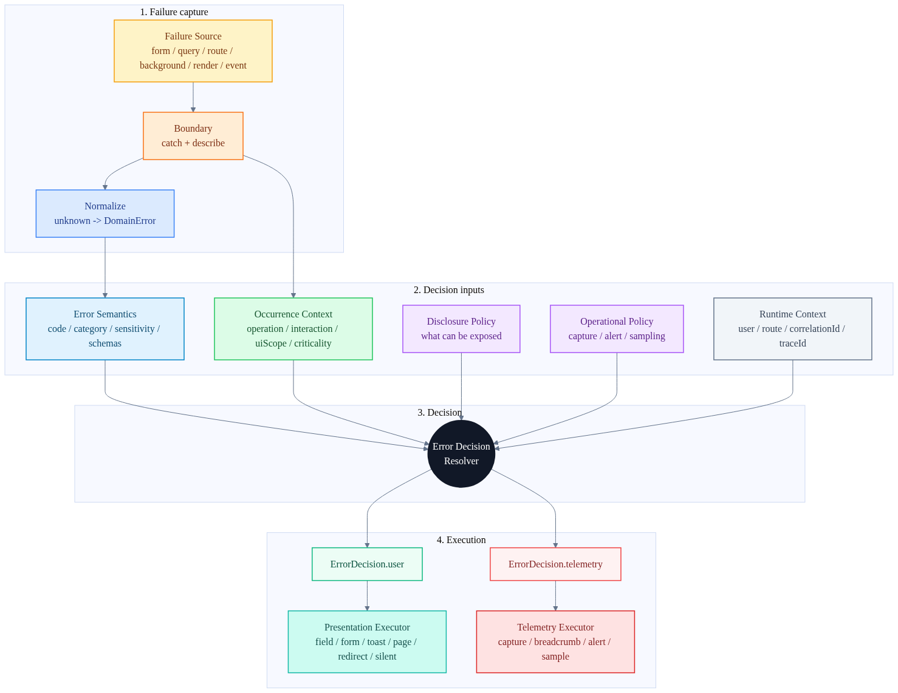
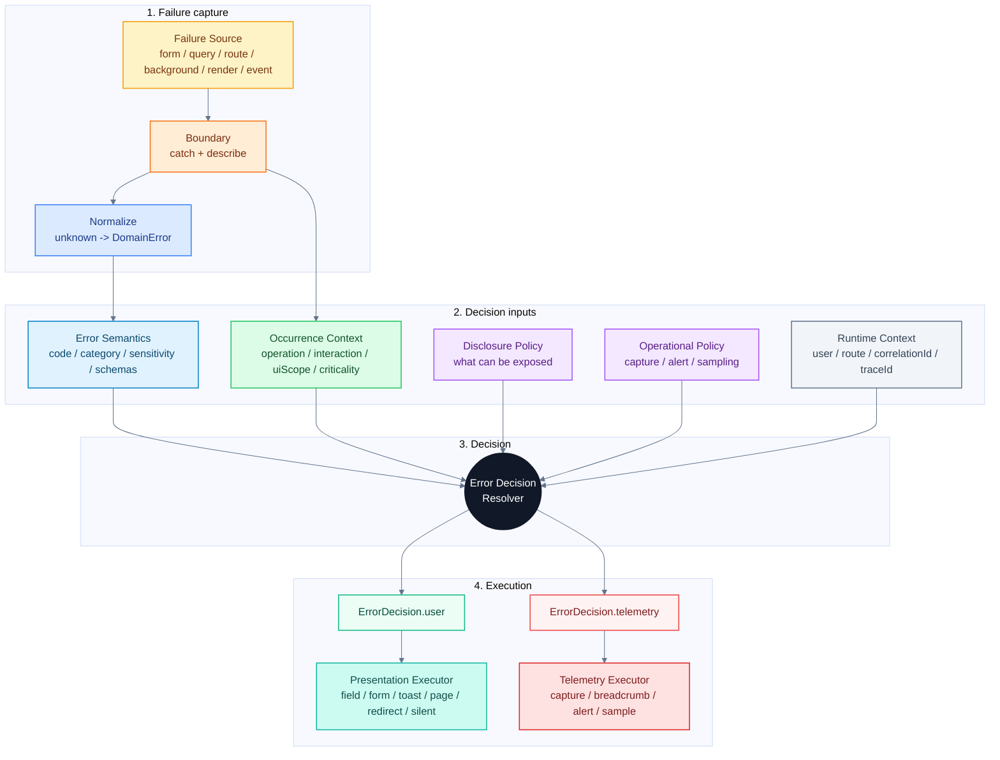
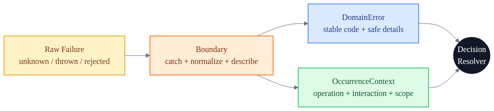
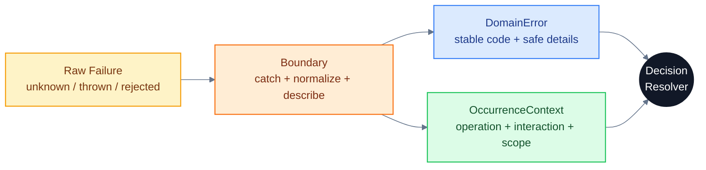
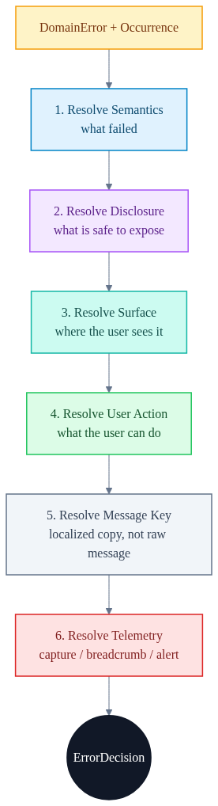
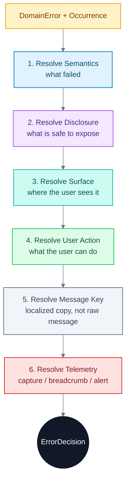
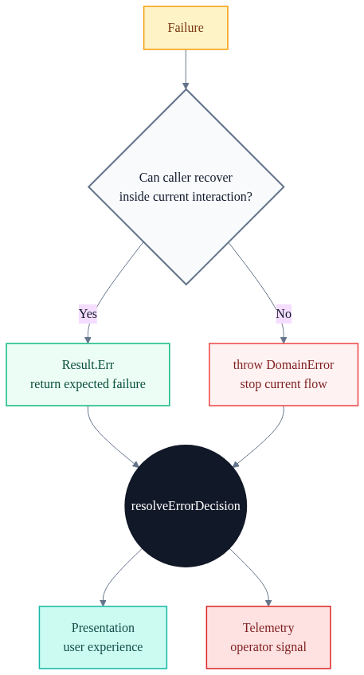
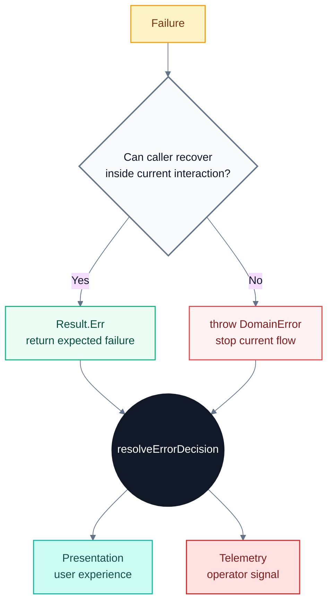
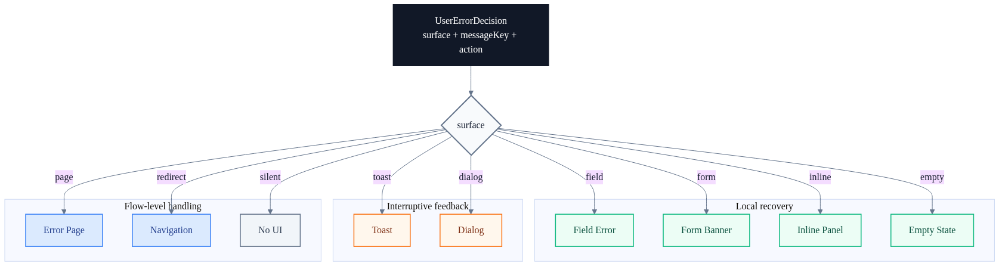
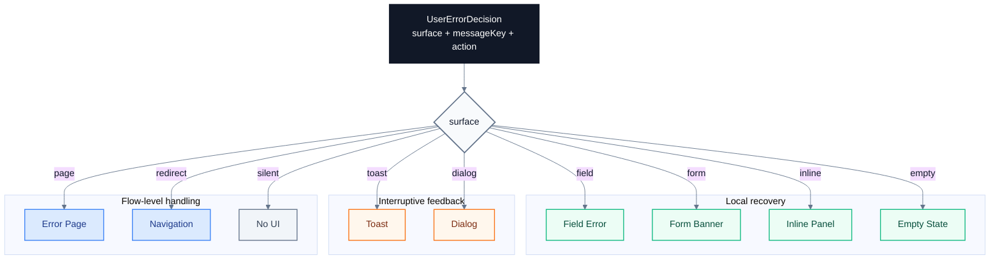

# NEW: Production Error Decision Architecture

이 문서는 특정 레포의 현재 구현을 정답으로 전제하지 않는다.

목표는 더 낫고, 더 제품적인, 더 운영 가능한 에러 아키텍처를 설계하는 것이다. 현재 데모는 사고를 위한 재료일 뿐이다.

핵심 명제는 다음이다.

> 에러 처리는 예외를 잡는 일이 아니라, 실패한 사용자 작업에 대해 사용자 경험과 운영 신호를 결정하는 일이다.

따라서 좋은 에러 아키텍처의 중심은 `try/catch`도, `Error` 클래스도, Sentry 연동도 아니다. 중심은 **Error Decision**이다.

```txt
error semantics
+ occurrence context
+ user actionability
+ UI impact scope
+ disclosure/security policy
+ operational/business criticality
= error decision
```

## 왜 다시 설계해야 하는가

많은 에러 시스템은 다음 순서로 발전한다.

```txt
unknown error
-> typed error
-> error code
-> registry
-> toast/log/report
```

이 흐름은 데모나 작은 제품에서는 충분해 보인다. 에러 코드가 생기고, 기본 메시지도 생기고, 로깅도 한 곳으로 모인다.

하지만 제품이 커지면 곧 한계가 온다.

`NOT_FOUND` 하나만 해도 상황에 따라 완전히 다르게 보여야 한다.

| 상황                         | 적절한 사용자 경험 | 적절한 운영 신호   |
| ---------------------------- | ------------------ | ------------------ |
| 검색 결과 없음               | empty state        | 없음               |
| 상세 페이지 리소스 없음      | 404 page           | breadcrumb         |
| 폼에서 선택한 쿠폰 없음      | form error         | info 또는 없음     |
| 백그라운드 동기화 대상 없음  | silent             | sampled breadcrumb |
| 권한 때문에 없는 것처럼 숨김 | generic 404        | warning capture    |

같은 코드라도 표현과 로깅이 다르다. 따라서 에러 코드만으로 UX와 telemetry를 결정하면 설계가 금방 틀어진다.

## 문제의 본질

사용자는 "에러가 발생했다"는 사실보다 "이제 무엇을 해야 하는가"를 알고 싶어 한다.

운영자는 "에러가 발생했다"는 사실보다 "이게 장애인가, 노이즈인가, 조사할 가치가 있는가"를 알고 싶어 한다.

좋은 에러 아키텍처는 이 두 질문에 동시에 답해야 한다.

```txt
User question:
  지금 무엇이 막혔고, 내가 무엇을 할 수 있는가?

Operator question:
  이 실패는 기록해야 하는가, 묶어야 하는가, 사람을 깨워야 하는가?
```

이 두 질문은 서로 독립적이다.

사용자에게 field error를 보여주지만 capture는 하지 않는 경우가 있다. 반대로 사용자에게 아무것도 보여주지 않지만 내부 capture가 필요한 경우도 있다.

그래서 사용자 표현과 운영 신호는 하나의 `present/log` 쌍으로 묶으면 안 된다.

## 핵심 용어

이 문서에서 사용하는 용어는 다음과 같다.

| 용어               | 의미                                                        |
| ------------------ | ----------------------------------------------------------- |
| Error Semantics    | 에러의 본질. 어떤 실패인가.                                 |
| Occurrence Context | 에러가 발생한 사건의 맥락. 어디서, 어떤 작업 중 실패했는가. |
| Disclosure         | 사용자에게 어느 정도까지 공개할 수 있는가.                  |
| Actionability      | 사용자가 지금 할 수 있는 행동은 무엇인가.                   |
| UI Impact Scope    | UI의 어느 범위가 손상되었는가.                              |
| Criticality        | 제품/운영 관점에서 얼마나 중요한 흐름인가.                  |
| Error Decision     | 사용자 표현과 운영 신호에 대한 최종 결정.                   |
| Presentation       | 결정된 사용자 표현을 실제 UI로 실행하는 것.                 |
| Telemetry          | 결정된 운영 신호를 report, breadcrumb, alert로 실행하는 것. |

## 전체 구조

프로덕션 구조는 다음처럼 나누는 것이 좋다.





중요한 점은 `Decision Resolver`가 중심이라는 것이다.

Registry는 에러 사전이다. Boundary는 사건을 설명한다. Resolver는 결정을 만든다. Presenter와 Reporter는 결정을 실행한다.

## 경계 원칙

각 경계는 자기 책임만 가져야 한다.

| 경계              | 책임                         | 침범하면 안 되는 것    |
| ----------------- | ---------------------------- | ---------------------- |
| Semantics         | 에러의 본질 정의             | 화면별 UX              |
| Boundary          | 실패 사건 설명               | Sentry/toast 직접 호출 |
| Decision Resolver | 사용자 표현과 운영 신호 결정 | UI 렌더링, 벤더 호출   |
| Presentation      | UI 실행                      | 에러 코드 재해석       |
| Telemetry         | report/alert 실행            | 정책 재판단            |

이 원칙이 무너지면 에러 정책이 빠르게 흩어진다.

예를 들어 UI 컴포넌트가 `error.code`를 직접 보고 toast를 띄우기 시작하면, 중앙 정책은 장식이 된다.

반대로 Registry가 화면별 surface를 모두 들기 시작하면, 에러 사전이 UI 설정 파일로 변한다.

## Error Semantics

Semantics는 "이 에러가 무엇인가"를 정의한다.

Registry는 이 역할을 맡을 수 있다. 하지만 Registry는 최종 UX를 결정하는 곳이 아니다.

좋은 semantics 모델은 다음 정도를 가진다.

```ts
type ErrorCategory = "business" | "operational" | "fault";

type ErrorSensitivity =
  | "public"
  | "auth"
  | "permission"
  | "pii"
  | "business-sensitive"
  | "internal";

interface ErrorSemantics {
  code: string;
  category: ErrorCategory;
  sensitivity: ErrorSensitivity;
  defaultHttpStatus: number;
  defaultRetryable: boolean;
  defaultMessageKey: string;
  detailsExposure: "none" | "allowlist";
  detailsAllowlist?: readonly string[];
}
```

Semantics는 상대적으로 안정적이어야 한다.

`INVALID_CREDENTIALS`가 인증 실패라는 사실은 화면마다 바뀌지 않는다. 하지만 그것을 field error로 보여줄지, form banner로 보여줄지는 화면과 interaction에 따라 바뀐다.

### Semantics가 가져도 되는 것

Registry 또는 semantics catalog는 다음을 가져도 된다.

- 에러 코드
- 도메인 분류
- 보안 민감도
- 기본 HTTP status
- 기본 retry 가능성
- 기본 message key
- details schema
- details 공개 allowlist

### Semantics가 가지면 위험한 것

다음은 semantics에 넣으면 장기적으로 위험하다.

- 최종 UI surface
- 최종 log level
- alert 여부
- 특정 React component
- 특정 화면의 field mapping
- 특정 toast 문구
- 특정 redirect URL

이 값들은 에러의 본질이 아니라 발생 맥락과 제품 정책의 결과다.

## Occurrence Context

Occurrence는 "어떤 실패 사건이 발생했는가"를 설명한다.

에러 코드는 원인을 설명한다. Occurrence는 사건을 설명한다.

```ts
type InteractionKind =
  | "page-load"
  | "query"
  | "mutation"
  | "form-submit"
  | "background-sync"
  | "route-guard"
  | "event-handler"
  | "render";

type UiScope = "field" | "form" | "component" | "panel" | "page" | "session" | "background";

type Criticality = "low" | "normal" | "core" | "revenue" | "security";

interface OccurrenceContext {
  operation: string;
  interaction: InteractionKind;
  uiScope: UiScope;
  criticality: Criticality;
  fieldPath?: string;
  resource?: string;
  userCanRetry?: boolean;
  idempotent?: boolean;
  background?: boolean;
}
```

`operation`은 제품 언어여야 한다.

좋은 예:

```txt
auth.login
checkout.pay
document.save
team.invite
profile.prefetch
```

나쁜 예:

```txt
POST /api/v1/x
button-click
fetch failed
unknown action
```

URL이나 함수명은 debugging에는 도움된다. 하지만 UX 정책과 운영 중요도를 결정하기에는 너무 기술적이다.

## Boundary의 역할

Boundary는 에러가 시스템으로 들어오는 문이다.

Boundary는 단순히 catch하는 곳이 아니다. Boundary는 occurrence를 붙이는 곳이다.





Boundary별 기본값은 다음처럼 잡을 수 있다.

| Boundary                | interaction       | uiScope      | 기본 criticality       |
| ----------------------- | ----------------- | ------------ | ---------------------- |
| Form Action             | `form-submit`     | `form`       | `normal`               |
| Server Action           | `mutation`        | `component`  | `normal`               |
| Query Boundary          | `query`           | `component`  | `normal`               |
| Route Guard             | `route-guard`     | `page`       | `security` 또는 `core` |
| Error Boundary          | `render`          | `page`       | `core`                 |
| Browser Global Boundary | `event-handler`   | `session`    | `normal`               |
| Background Worker       | `background-sync` | `background` | `low`                  |

기본값은 편의 장치다. 제품적으로 중요한 작업은 호출자가 반드시 `operation`과 `criticality`를 명시해야 한다.

예:

```ts
withErrorBoundary(() => payInvoice(input), {
  operation: "billing.payInvoice",
  interaction: "form-submit",
  uiScope: "form",
  criticality: "revenue",
  userCanRetry: true,
  idempotent: false,
});
```

## Disclosure Policy

Disclosure는 사용자에게 얼마나 공개할 수 있는지를 결정한다.

의도한 에러라고 해서 항상 구체적으로 보여주면 안 된다. 보안, 개인정보, 비즈니스 민감도가 별도 축으로 필요하다.

```ts
type DisclosureLevel = "specific" | "safe-vague" | "generic" | "support-only";
```

| 수준           | 의미                           | 예시                                   |
| -------------- | ------------------------------ | -------------------------------------- |
| `specific`     | 구체 이유를 알려도 안전        | "이메일 형식을 확인해주세요."          |
| `safe-vague`   | 행동은 알려주되 원인은 흐림    | "이메일 또는 비밀번호를 확인해주세요." |
| `generic`      | 실패만 알리고 내부 원인은 숨김 | "요청을 처리하지 못했습니다."          |
| `support-only` | 사용자는 지원 코드 중심        | "지원 코드와 함께 문의해주세요."       |

### Sensitivity와 disclosure

민감도별 기본 disclosure는 다음처럼 잡을 수 있다.

| sensitivity          | 기본 disclosure                  | 이유                                   |
| -------------------- | -------------------------------- | -------------------------------------- |
| `public`             | `specific`                       | 공개해도 공격 표면이 작음              |
| `auth`               | `safe-vague`                     | 계정 존재 여부, 인증 원인 노출 방지    |
| `permission`         | `safe-vague`                     | 권한 모델과 리소스 존재 여부 노출 방지 |
| `pii`                | `safe-vague` 또는 `support-only` | 개인정보 노출 방지                     |
| `business-sensitive` | `safe-vague`                     | 가격, 정책, 심사 사유 등 보호          |
| `internal`           | `generic` 또는 `support-only`    | 내부 구현 정보 보호                    |

예:

| 코드                  | 나쁜 메시지              | 더 나은 메시지                         |
| --------------------- | ------------------------ | -------------------------------------- |
| `INVALID_CREDENTIALS` | "비밀번호가 틀렸습니다." | "이메일 또는 비밀번호를 확인해주세요." |
| `AUTH_REQUIRED`       | "JWT가 만료되었습니다."  | "다시 로그인해주세요."                 |
| `FORBIDDEN`           | "admin role이 없습니다." | "이 작업을 수행할 권한이 없습니다."    |
| `SCHEMA_MISMATCH`     | "plan enum mismatch"     | "요청을 처리하지 못했습니다."          |

## User Actionability

Actionability는 사용자가 지금 할 수 있는 행동이다.

메시지는 원인 설명보다 다음 행동을 우선해야 한다.

```ts
type UserAction =
  | "fix-input"
  | "retry"
  | "login"
  | "request-access"
  | "choose-different-option"
  | "wait"
  | "go-back"
  | "contact-support"
  | "none";
```

| action                    | 적절한 표현                          |
| ------------------------- | ------------------------------------ |
| `fix-input`               | field/form message                   |
| `retry`                   | retry button, toast action           |
| `login`                   | redirect 또는 login CTA              |
| `request-access`          | 권한 요청 CTA                        |
| `choose-different-option` | 대체 선택지 안내                     |
| `wait`                    | 제한 시간 또는 재시도 가능 시점 안내 |
| `go-back`                 | 이전 화면 또는 목록으로 이동         |
| `contact-support`         | support code 노출                    |
| `none`                    | CTA 없는 generic copy                |

Actionability는 에러 코드만으로 정할 수 없다.

`TIMEOUT`은 사용자가 즉시 재시도할 수 있을 수도 있고, 중복 결제를 막기 위해 기다려야 할 수도 있다.

`FORBIDDEN`은 권한 요청이 가능할 수도 있고, 영구적으로 막힌 작업일 수도 있다.

## UI Impact Scope

UI impact scope는 화면의 어느 범위가 손상되었는지를 말한다.

Surface는 에러 종류가 아니라 impact scope와 recovery location으로 결정해야 한다.

```ts
type ErrorSurface =
  | "field"
  | "form"
  | "inline"
  | "empty"
  | "toast"
  | "dialog"
  | "page"
  | "redirect"
  | "silent";
```

| surface    | 쓰는 경우                    | 예시                     |
| ---------- | ---------------------------- | ------------------------ |
| `field`    | 특정 입력을 고치면 해결      | 이메일 형식 오류         |
| `form`     | 폼 전체 상태를 고쳐야 함     | 로그인 실패              |
| `inline`   | 특정 컴포넌트만 실패         | 사이드 패널 로딩 실패    |
| `empty`    | 실패가 비어 있음 상태와 같음 | 검색 결과 없음           |
| `toast`    | 화면은 유지, 일시적 알림     | 네트워크 일시 장애       |
| `dialog`   | 사용자 선택이 필요           | 결제 재시도/취소         |
| `page`     | 페이지를 계속 사용할 수 없음 | 필수 데이터 로드 실패    |
| `redirect` | 다른 경로가 회복 경로        | 로그인 필요              |
| `silent`   | 보여주면 방해만 됨           | background prefetch 실패 |

`business` 에러도 page가 될 수 있다. `FORBIDDEN`이 페이지 접근 자체를 막는다면 page나 redirect가 맞다.

`fault` 에러도 toast가 될 수 있다. 특정 panel만 실패했고 나머지 화면이 살아 있다면 page 전체를 깨지 않는 편이 낫다.

## Operational Criticality

Criticality는 에러 코드의 속성이 아니라 제품 흐름의 속성이다.

```ts
type Criticality = "low" | "normal" | "core" | "revenue" | "security";
```

| criticality | 예시                       |
| ----------- | -------------------------- |
| `low`       | avatar prefetch, 추천 위젯 |
| `normal`    | 일반 목록 조회             |
| `core`      | 문서 저장, 주요 CRUD       |
| `revenue`   | 결제, 구독, 가격 계산      |
| `security`  | 로그인, MFA, 권한 변경     |

같은 `TIMEOUT`이라도 criticality에 따라 달라진다.

```txt
TIMEOUT + low + background
  -> silent, sampled warning

TIMEOUT + revenue + form-submit
  -> form/dialog, warning capture

TIMEOUT + security + page-load
  -> page/form, error capture, alert candidate
```

## Error Decision

`ErrorDecision`은 사용자 표현과 운영 신호를 분리해서 담는다.

```ts
interface UserErrorDecision {
  surface: ErrorSurface;
  disclosure: DisclosureLevel;
  messageKey: string;
  action: UserAction;
  target?: string;
  supportCode?: string;
  retryAfterMs?: number;
}

interface TelemetryDecision {
  capture: boolean;
  level: "info" | "warning" | "error" | "fatal";
  breadcrumb: boolean;
  alert: boolean;
  sampleRate?: number;
  fingerprint?: readonly string[];
  tags?: Record<string, string>;
}

interface ErrorDecision {
  user: UserErrorDecision;
  telemetry: TelemetryDecision;
}
```

이 구조가 중요한 이유는 사용자 표현과 운영 신호가 독립적이기 때문이다.

| 상황                     | user.surface         |  telemetry.capture |
| ------------------------ | -------------------- | -----------------: |
| 필수값 누락              | `field`              |              false |
| 로그인 실패              | `form`               | false 또는 sampled |
| 결제 승인 실패           | `form` 또는 `dialog` |               true |
| background prefetch 실패 | `silent`             | false 또는 sampled |
| RSC 렌더링 crash         | `page`               |               true |

## Decision Resolver

`Decision Resolver`는 순수 함수에 가까워야 한다.

```ts
interface ErrorDecisionInput {
  error: DomainError;
  semantics: ErrorSemantics;
  occurrence: OccurrenceContext;
  runtime: "server" | "client";
  route?: string;
  user?: { id: string; role?: string } | null;
  correlationId?: string;
  traceId?: string;
}

function resolveErrorDecision(input: ErrorDecisionInput): ErrorDecision {
  const disclosure = resolveDisclosure(input);
  const surface = resolveSurface(input, disclosure);
  const action = resolveAction(input, surface);
  const telemetry = resolveTelemetry(input, surface);

  return {
    user: {
      surface,
      disclosure,
      messageKey: resolveMessageKey(input, disclosure),
      action,
      target: resolveTarget(input, surface),
      supportCode: shouldExposeSupportCode(input, disclosure) ? input.correlationId : undefined,
    },
    telemetry,
  };
}
```

Resolver는 다음을 하지 않는다.

- toast를 띄우지 않는다.
- Sentry를 호출하지 않는다.
- router를 호출하지 않는다.
- DOM을 만지지 않는다.
- raw error message를 사용자 메시지로 쓰지 않는다.

Resolver는 결정만 한다.

## Decision Pipeline

결정 순서는 중요하다.





권장 순서는 다음이다.

1. 보안상 공개 불가한 정보를 먼저 차단한다.
2. UI impact scope로 surface를 고른다.
3. 사용자 행동 가능성으로 action을 고른다.
4. disclosure 수준에 맞는 message key를 고른다.
5. criticality와 category로 telemetry를 결정한다.
6. 마지막에 제한적인 override를 적용한다.

Override는 적게 유지해야 한다. Override가 많아지면 resolver는 화면별 if문 모음이 된다.

## Surface 규칙 예시

초기 surface resolver는 거대한 룰 엔진일 필요가 없다.

```txt
if uiScope is field and fieldPath exists:
  surface = field

else if interaction is form-submit:
  surface = form

else if interaction is route-guard and action is login:
  surface = redirect

else if uiScope is page:
  surface = page

else if uiScope is background:
  surface = silent

else if category is operational and userCanRetry:
  surface = toast

else:
  surface = inline
```

이 규칙은 완벽하지 않다. 하지만 코드별 surface 하드코딩보다 낫다.

## Disclosure 규칙 예시

```txt
sensitivity public:
  specific

sensitivity auth:
  safe-vague

sensitivity permission:
  safe-vague

sensitivity pii:
  safe-vague or support-only

sensitivity business-sensitive:
  safe-vague

sensitivity internal:
  generic or support-only
```

`fault`는 기본적으로 `generic` 이상으로 제한한다.

사용자에게 지원 경로가 필요한 경우에만 `supportCode`를 노출한다.

## Telemetry 규칙 예시

Telemetry는 세 질문을 분리해야 한다.

| 질문                             | 출력         |
| -------------------------------- | ------------ |
| 디버깅을 위해 기록할 것인가?     | `capture`    |
| 사용자 영향 trail을 남길 것인가? | `breadcrumb` |
| 사람을 깨울 것인가?              | `alert`      |

초기 규칙은 다음처럼 시작할 수 있다.

| 조건                           |            capture | level       | breadcrumb |     alert |
| ------------------------------ | -----------------: | ----------- | ---------: | --------: |
| field validation               |              false | info        |      false |     false |
| business + low/normal          | false 또는 sampled | info        |       true |     false |
| business + revenue/security    |               true | warning     |       true |     false |
| operational + retryable        |            sampled | warning     |       true |     false |
| fault + component/page/session |               true | error       |       true |     false |
| fault + revenue/security       |               true | error/fatal |       true | true 후보 |

Alert는 severity만으로 결정하지 않는다.

Alert 판단에는 criticality, runtime, uiScope, category, sensitivity, 빈도, 최근 배포 여부가 들어가야 한다.

초기 구현은 단순해도 된다.

```txt
alert = category is fault
  and criticality in revenue/security/core
  and uiScope in page/session
  and runtime is server
```

나중에 rate-based alert로 확장할 수 있도록 `alert`와 `fingerprint`를 decision에 포함한다.

## Result와 Throw

`Result` vs `throw`는 중요하다. 하지만 이것은 최종 UX 정책이 아니라 실패 전달 방식이다.





| 질문                                         | Result.Err | throw       |
| -------------------------------------------- | ---------- | ----------- |
| 같은 화면에서 수정 가능한가?                 | 예         | 아니오      |
| 실패가 interaction의 정상 결과인가?          | 예         | 보통 아니오 |
| 요청/렌더 흐름을 계속할 수 있는가?           | 예         | 아니오      |
| Error Boundary나 route interrupt가 필요한가? | 아니오     | 예          |

중요한 점은 `Result`든 `throw`든 최종 표현은 `ErrorDecision`으로 결정해야 한다는 것이다.

`Result.Err`도 capture가 필요할 수 있다. 결제 실패, 심사 실패, 보안 실패는 expected business outcome이어도 운영적으로 중요하다.

`throw`도 항상 page fallback은 아니다. Query boundary에서 throw된 에러는 component fallback이나 toast로 처리될 수 있다.

## Presentation Execution

Presentation layer는 `ErrorDecision.user`를 실행한다.





나쁜 UI 코드:

```ts
if (error.code === "VALIDATION") {
  showFieldError(error.details);
}

if (error.code === "HTTP_SERVER_ERROR") {
  toast("서버 에러가 발생했습니다.");
}
```

좋은 UI 코드:

```ts
const decision = resolveErrorDecision(input);
present(decision.user);
```

Presentation은 code를 몰라도 되어야 한다.

예외는 validation details처럼 field mapping이 필요한 경우다. 이때도 decision이 `target`, `details exposure`, `messageKey`를 명시해야 한다.

## Telemetry Execution

Telemetry layer도 에러 코드를 다시 해석하지 않는다.

```ts
function executeTelemetryDecision(
  error: DomainError,
  decision: TelemetryDecision,
  ctx: TelemetryContext,
) {
  if (decision.capture) {
    reporter.capture(error, {
      level: decision.level,
      fingerprint: decision.fingerprint,
      tags: decision.tags,
      sampleRate: decision.sampleRate,
      ctx,
    });
  }

  if (decision.breadcrumb) {
    reporter.breadcrumb(error, ctx);
  }

  if (decision.alert) {
    notifier.alert(error, {
      level: decision.level,
      fingerprint: decision.fingerprint,
      ctx,
    });
  }
}
```

Reporter와 Notifier는 delivery 책임만 가진다.

Sentry adapter는 Sentry를 호출한다. Pager adapter는 pager를 호출한다. 하지만 "이 상황에서 호출해야 하는가"는 resolver가 이미 결정해야 한다.

## Serialization Boundary

서버에서 클라이언트로 넘어가는 에러는 보안 경계다.

Raw `error.message`는 사용자에게 보내면 안 된다. Message는 registry의 key와 disclosure policy를 통해 선택되어야 한다.

Client-safe payload는 다음 정도만 포함한다.

```ts
interface ClientErrorPayload {
  code: string;
  messageKey: string;
  disclosure: DisclosureLevel;
  supportCode?: string;
  retryAfterMs?: number;
  details?: unknown;
}
```

`details`는 allowlist를 통과한 값만 포함한다.

예:

```txt
VALIDATION:
  details.fieldErrors 공개 가능

INVALID_CREDENTIALS:
  details 공개 안 함

SCHEMA_MISMATCH:
  details 공개 안 함

RATE_LIMITED:
  retryAfterMs 공개 가능
```

API response에 `surface`를 넣을지는 신중해야 한다.

서버가 Web UI surface를 결정하면 Mobile, CLI, Admin 같은 다른 consumer와 충돌할 수 있다. API는 `messageKey`, `disclosure`, `action`, `supportCode` 정도를 보내고, surface는 클라이언트 context로 다시 결정하는 편이 낫다.

## Scenario Matrix

아래 표는 같은 아키텍처가 실제 제품 상황에서 어떻게 동작하는지 보여준다.

| code                   | occurrence         | user decision                            | telemetry decision             |
| ---------------------- | ------------------ | ---------------------------------------- | ------------------------------ |
| `VALIDATION`           | signup email field | field, specific, fix-input               | no capture                     |
| `INVALID_CREDENTIALS`  | login form         | form, safe-vague, fix-input              | info breadcrumb 또는 sampled   |
| `AUTH_REQUIRED`        | protected page     | redirect, safe-vague, login              | info breadcrumb                |
| `FORBIDDEN`            | admin page         | page, safe-vague, request-access         | warning capture                |
| `NOT_FOUND`            | search results     | empty, specific, none                    | no capture                     |
| `NOT_FOUND`            | detail page        | page, safe-vague, go-back                | info breadcrumb                |
| `TIMEOUT`              | autocomplete       | silent/toast, generic, retry             | sampled warning                |
| `TIMEOUT`              | checkout payment   | form/dialog, safe-vague, retry/wait      | warning capture                |
| `RATE_LIMITED`         | resend code        | form, safe-vague, wait                   | info/warning breadcrumb        |
| `SCHEMA_MISMATCH`      | product page query | page, generic, retry/contact             | error capture                  |
| `UNKNOWN_SERVER_ERROR` | checkout submit    | form/page, support-only, contact-support | fatal capture, alert candidate |
| `UNKNOWN_CLIENT_ERROR` | click handler      | toast, generic, retry                    | error capture                  |

이 표가 코드보다 먼저 합의되어야 한다.

팀이 이 decision matrix에 동의하지 못하면 타입 설계를 아무리 잘해도 UX가 흔들린다.

## Concrete Flow: Signup Validation

```txt
User submits signup form
-> email is invalid
-> VALIDATION
-> occurrence: form-submit, uiScope field, criticality normal
-> disclosure: specific
-> surface: field
-> action: fix-input
-> telemetry: no capture
```

사용자 표현:

```txt
이메일 형식을 확인해주세요.
```

운영 신호:

```txt
없음. 필요하면 product analytics event만 별도 기록.
```

## Concrete Flow: Login Failure

```txt
User submits login form
-> credentials invalid
-> INVALID_CREDENTIALS
-> occurrence: form-submit, uiScope form, criticality security
-> disclosure: safe-vague
-> surface: form
-> action: fix-input
-> telemetry: sampled info or security analytics
```

사용자 표현:

```txt
이메일 또는 비밀번호를 확인해주세요.
```

보여주면 안 되는 표현:

```txt
이 이메일은 존재하지 않습니다.
비밀번호가 틀렸습니다.
```

## Concrete Flow: Checkout Timeout

```txt
User clicks pay
-> payment provider timeout
-> TIMEOUT
-> occurrence: form-submit, uiScope form, criticality revenue
-> disclosure: safe-vague
-> surface: form or dialog
-> action: retry or wait
-> telemetry: warning capture, breadcrumb, no immediate page unless elevated
```

사용자 표현:

```txt
결제 상태를 확인하지 못했습니다. 잠시 후 다시 시도해주세요.
```

중요한 점:

재시도 가능하다고 바로 retry 버튼을 보여주면 중복 결제 위험이 있다. `idempotent`와 provider 상태 확인 가능 여부가 action을 바꾼다.

## Concrete Flow: Page Schema Mismatch

```txt
Product page query succeeds
-> response shape invalid
-> SCHEMA_MISMATCH
-> occurrence: query, uiScope page, criticality core
-> disclosure: generic
-> surface: page
-> action: retry or contact-support
-> telemetry: error capture, breadcrumb, alert candidate if elevated
```

사용자 표현:

```txt
페이지를 불러오지 못했습니다. 잠시 후 다시 시도해주세요.
```

운영 신호:

```txt
capture true
level error
fingerprint product.read + SCHEMA_MISMATCH
```

## Concrete Flow: Background Prefetch

```txt
App prefetches recommendation data
-> network failure
-> NETWORK_ERROR
-> occurrence: background-sync, uiScope background, criticality low
-> disclosure: generic
-> surface: silent
-> action: none
-> telemetry: sampled breadcrumb or no capture
```

사용자에게 보여주지 않는다.

백그라운드 실패를 toast로 띄우면 사용자는 자신이 하던 작업과 무관한 방해를 받는다.

## Operation Registry

`criticality`를 매번 호출자가 넘기게 하면 누락이 생긴다.

중대 제품에서는 operation registry를 둘 수 있다.

```ts
interface OperationMeta {
  operation: string;
  owner: string;
  criticality: Criticality;
  defaultUiScope: UiScope;
  piiRisk: boolean;
}
```

예:

```ts
const OPERATIONS = {
  "auth.login": {
    owner: "security",
    criticality: "security",
    defaultUiScope: "form",
    piiRisk: true,
  },
  "checkout.pay": {
    owner: "payments",
    criticality: "revenue",
    defaultUiScope: "form",
    piiRisk: true,
  },
  "profile.prefetch": {
    owner: "growth",
    criticality: "low",
    defaultUiScope: "background",
    piiRisk: false,
  },
} satisfies Record<string, OperationMeta>;
```

이 registry는 Error Registry와 다르다.

Error Registry는 실패의 본질을 정의한다. Operation Registry는 제품 작업의 중요도를 정의한다.

## Observability Details

운영 가능한 에러 아키텍처에는 correlation, fingerprint, sampling이 필요하다.

### Correlation ID

`correlationId`는 사용자 문의, 서버 로그, Sentry event, API response를 연결한다.

사용자에게 항상 보여줄 필요는 없다.

노출 기준:

| 조건                    | supportCode 노출 |
| ----------------------- | ---------------: |
| field validation        |            false |
| auth failure            |            false |
| generic fault           |        true 가능 |
| support-only disclosure |             true |
| user action 없음        |        true 가능 |

### Fingerprint

Fingerprint는 grouping 단위다.

좋은 후보:

```ts
[occurrence.operation, error.code, occurrence.interaction];
```

나쁜 후보:

```ts
[fullUrlWithUserId, rawErrorMessage, email];
```

고카디널리티 값과 PII를 fingerprint에 넣으면 리포팅 품질이 망가진다.

### Sampling

Low-value event는 sample한다.

High-value event는 전부 capture한다.

예:

| 이벤트                          |           sample |
| ------------------------------- | ---------------: |
| background avatar fetch timeout |             0.01 |
| login invalid credentials       | 보안 정책에 따름 |
| checkout payment failure        |              1.0 |
| schema mismatch                 |              1.0 |
| unknown server fault            |              1.0 |

Sampling은 resolver가 `sampleRate`를 결정하고, reporter wrapper가 실행하는 편이 좋다.

## Policy Ownership

에러 결정 정책은 개발자 혼자 정하면 안 된다.

프로덕션에서는 최소한 다음 관점이 필요하다.

| 정책          | 주요 소유자                     |
| ------------- | ------------------------------- |
| disclosure    | security / privacy / product    |
| message       | product / design / localization |
| actionability | product / design                |
| criticality   | product / engineering           |
| alert         | engineering / SRE               |
| sampling      | engineering / observability     |

아키텍처는 이 협업이 가능하도록 정책을 코드에 명시해야 한다.

숨겨진 if문과 화면별 ad hoc toast는 리뷰하기 어렵다.

## Testing Strategy

이 아키텍처의 핵심 테스트 대상은 class나 adapter가 아니라 decision이다.

### Decision Unit Tests

`resolveErrorDecision()`은 순수 함수로 테스트한다.

필수 케이스:

- `VALIDATION + field` -> field, specific, no capture
- `INVALID_CREDENTIALS + login form` -> form, safe-vague
- `AUTH_REQUIRED + route guard` -> redirect
- `FORBIDDEN + admin page` -> page, warning capture
- `NOT_FOUND + search` -> empty, no capture
- `TIMEOUT + background` -> silent, sampled warning
- `UNKNOWN_SERVER_ERROR + revenue` -> support-only, capture, alert candidate

### Boundary Tests

Boundary가 올바른 occurrence를 제공하는지 테스트한다.

예:

- form boundary는 `interaction: "form-submit"`을 제공한다.
- query boundary는 `interaction: "query"`를 제공한다.
- route guard는 `interaction: "route-guard"`를 제공한다.
- global browser boundary는 `uiScope: "session"`을 제공한다.

### Sink Tests

Sink는 decision을 재해석하지 않아야 한다.

예:

- `surface: "silent"`이면 UI를 띄우지 않는다.
- `capture: false`이면 reporter capture가 호출되지 않는다.
- `breadcrumb: true`이면 capture와 독립적으로 breadcrumb가 남는다.
- `alert: false`이면 severity가 높아도 pager가 호출되지 않는다.

## Migration Strategy

기존 registry 기반 구조에서 옮긴다면 단계적으로 가야 한다.

### Phase 1: Vocabulary 추가

먼저 타입을 추가한다.

- `DisclosureLevel`
- `UserAction`
- `ErrorSurface`
- `Criticality`
- `OccurrenceContext`
- `UserErrorDecision`
- `TelemetryDecision`
- `ErrorDecision`

동작은 바꾸지 않는다.

### Phase 2: Registry 값을 hint로 낮추기

`present`, `log`, `severity`를 최종 결정이 아니라 hint로 본다.

예:

```ts
interface ErrorSemantics {
  category: ErrorCategory;
  sensitivity: ErrorSensitivity;
  defaultSurfaceHint?: ErrorSurface;
  defaultLogHint?: "info" | "warning" | "error" | "fatal" | "none";
  defaultSeverityHint?: "info" | "warning" | "error" | "fatal";
}
```

이름 변경은 작아 보이지만 mental model을 바꾼다.

### Phase 3: Resolver 추가

`resolveErrorDecision()`을 추가한다.

초기에는 기존 registry policy와 같은 결과를 내도 된다. 중요한 것은 decision이 독립 모델로 생기는 것이다.

### Phase 4: Boundary에 occurrence 배선

각 boundary가 기본 occurrence를 제공하게 한다.

호출자는 중요한 operation에 대해서만 명시적으로 override한다.

### Phase 5: Presentation/Telemetry 실행 분리

`handleError()`가 직접 `present/log/severity`를 해석하는 대신 decision을 만들고 실행하게 한다.

```txt
old:
  handleError(error, { present, log })

new:
  decision = resolveErrorDecision(error, occurrence)
  executeDecision(error, decision)
```

### Phase 6: 화면별 code 분기 제거

UI에 흩어진 `if error.code === ...` 분기를 줄인다.

남겨도 되는 분기는 validation field mapping처럼 domain details를 렌더링해야 하는 곳뿐이다.

## Minimal Viable Version

처음부터 완전한 policy engine을 만들 필요는 없다.

MVP는 다음이면 충분하다.

1. `OccurrenceContext` 타입.
2. `ErrorDecision` 타입.
3. `resolveErrorDecision()` 순수 함수.
4. surface/disclosure/telemetry 기본 규칙.
5. 주요 10개 시나리오 unit test.
6. form/query/page/background boundary에 occurrence 배선.

이 정도만 있어도 `intent -> present/log` 구조보다 훨씬 낫다.

## Anti-Patterns

### Registry를 화면 설정으로 만들기

나쁜 예:

```ts
EMAIL_ALREADY_EXISTS: {
  signupFormSurface: "field",
  adminInviteSurface: "toast",
  mobileSurface: "dialog",
}
```

좋은 예:

```ts
EMAIL_ALREADY_EXISTS: {
  category: "business",
  sensitivity: "public",
  defaultMessageKey: "error.emailAlreadyExists",
}
```

화면 차이는 occurrence와 presenter가 처리한다.

### UI가 error code를 직접 해석하기

나쁜 예:

```ts
if (error.code === "FORBIDDEN") {
  router.push("/request-access");
}
```

좋은 예:

```ts
if (decision.user.surface === "redirect") {
  router.push(resolveRedirectTarget(decision.user));
}
```

### Alert를 severity threshold로만 결정하기

나쁜 예:

```txt
severity >= error -> page
```

좋은 예:

```txt
alert = severity high
  + criticality high
  + user impact high
  + runtime server
  + fingerprint frequency elevated
```

### Raw message를 사용자에게 보여주기

Raw message는 내부 디버깅 정보다.

사용자 메시지는 `messageKey + disclosure + localization`으로 만들어야 한다.

## Open Questions

아직 제품마다 다르게 정해야 할 질문도 있다.

1. `operation`은 free-form string인가, typed union인가?
2. `criticality`는 호출자가 넘기는가, operation registry에서 가져오는가?
3. API response에 surface를 포함할 것인가?
4. Mobile/Web/Admin이 같은 decision을 공유할 것인가, surface만 재결정할 것인가?
5. Sampling은 resolver가 결정할 것인가, reporter wrapper가 결정할 것인가?
6. Alert는 boolean으로 시작할 것인가, reason/dedupKey까지 포함할 것인가?
7. Validation details와 disclosure allowlist를 어떻게 합칠 것인가?

권장 답은 다음이다.

| 질문               | 권장                                                  |
| ------------------ | ----------------------------------------------------- |
| operation 타입     | core는 string, app은 typed union                      |
| criticality        | 초기는 호출자 제공, 이후 operation registry           |
| API surface        | API는 surface보다 action/messageKey/supportCode 중심  |
| multi-platform     | semantics/decision 일부 공유, presentation은 플랫폼별 |
| sampling           | resolver는 sampleRate, reporter wrapper가 실행        |
| alert              | 초기 boolean, 이후 reason/dedupKey 확장               |
| validation details | schema allowlist + decision target으로 제한           |

## 결론

좋은 에러 아키텍처는 "의도한 에러와 의도하지 않은 에러"를 나누는 데서 끝나지 않는다.

그 구분은 필요하지만 충분하지 않다.

프로덕션에서 중요한 질문은 이것이다.

```txt
이 실패가 이 사용자 작업에서 발생했을 때,
사용자에게 무엇을 보여주고,
무엇을 할 수 있게 하며,
운영 시스템에는 어떤 신호를 남길 것인가?
```

이 질문의 답이 `ErrorDecision`이다.

Registry는 에러의 본질을 정의한다. Boundary는 실패 사건을 설명한다. Resolver는 결정을 만든다. UI와 telemetry는 그 결정을 실행한다.

이 경계가 생기면 에러 아키텍처는 예외 처리 유틸이 아니라 제품 UX와 운영 안정성을 함께 다루는 정책 시스템이 된다.
