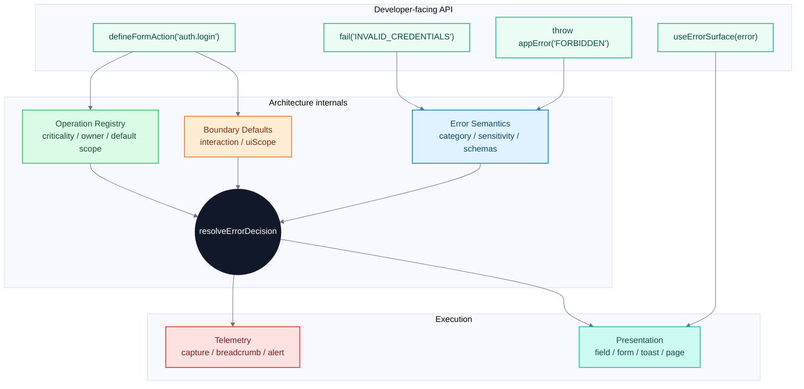

> **[HISTORICAL — 수렴(P0–P8) 이전 사료]** 이 문서가 기술하는 `packages/error-decision-system`과 데모 앱(`apps/error-decision-next`/`apps/error-decision-vite`)은 P8에서 은퇴(삭제)됐다. 결정 엔진·카탈로그·AppError는 `packages/error-core`(decision 모델)로 이식 완료. 현행 SSOT: 루트 [`README.md`](./README.md) + [`packages/error-core/ARCHITECTURE.md`](./packages/error-core/ARCHITECTURE.md). 본문은 사료적 맥락으로 읽을 것.

# NEW_DX: Developer Experience for Error Decision Architecture

이 문서는 `NEW.md`의 에러 결정 아키텍처를 개발자가 실제로 매일 사용할 수 있는 형태로 낮추는 방법을 다룬다.

핵심 전제는 명확하다.

> 아키텍처는 풍부해야 하지만, 호출부는 가벼워야 한다.

`ErrorDecision` 모델은 제품 UX와 운영 정책을 정교하게 만들기 위해 필요하다. 하지만 그 복잡도를 개발자에게 그대로 노출하면 오래 유지될 수 없다.

개발자가 매번 이런 코드를 써야 한다면 실패한 DX다.

```ts
handleError(error, {
  occurrence: {
    operation: "checkout.pay",
    interaction: "form-submit",
    uiScope: "form",
    criticality: "revenue",
    userCanRetry: true,
    idempotent: false,
  },
  telemetry: {
    capture: true,
    level: "warning",
    alert: false,
  },
});
```

이 정보는 시스템 내부에는 필요하다. 그러나 대부분의 호출부에서는 자동으로 채워져야 한다.

좋은 DX는 이런 모습에 가까워야 한다.

```ts
const login = defineFormAction("auth.login", async (input) => {
  const user = await authenticate(input);

  if (!user) {
    return fail("INVALID_CREDENTIALS");
  }

  return ok(user);
});
```

이 짧은 코드 뒤에서 시스템은 다음 결정을 내려야 한다.

```txt
operation: auth.login
error: INVALID_CREDENTIALS
interaction: form-submit
uiScope: form
criticality: security

-> form-level error
-> safe-vague message
-> no raw detail exposure
-> sampled info/security telemetry
```

## DX 원칙

좋은 에러 아키텍처의 DX 원칙은 다음이다.

| 원칙                             | 의미                                                                      |
| -------------------------------- | ------------------------------------------------------------------------- |
| 호출부는 짧아야 한다             | 대부분의 코드는 `fail(code)` 또는 `throw appError(code)` 수준이어야 한다. |
| 정책은 중앙에 있어야 한다        | 화면별 `if error.code` 분기를 줄인다.                                     |
| context는 boundary가 채워야 한다 | `form-submit`, `query`, `background` 같은 값은 helper가 안다.             |
| 개발자는 operation을 선언한다    | 제품 작업 이름이 policy lookup의 중심이 된다.                             |
| escape hatch는 있어야 한다       | 특수 케이스를 막으면 결국 우회 코드가 생긴다.                             |
| 잘못 쓰기 어려워야 한다          | raw `error.message` 노출, ad hoc toast, 직접 Sentry 호출을 어렵게 만든다. |

개발자가 매일 기억해야 하는 모델은 세 가지면 충분하다.

```txt
1. 이 코드는 어떤 operation 안에 있는가?
2. 어떤 error code를 반환하거나 던지는가?
3. Result로 회복할 수 있는가, throw로 흐름을 중단해야 하는가?
```

나머지는 시스템이 결정해야 한다.

```txt
surface
disclosure
messageKey
supportCode
telemetry level
sampling
alert
```

## DX 아키텍처

`NEW.md`의 내부 아키텍처를 개발자 경험 관점에서 보면 두 개의 레이어가 필요하다.



개발자는 위쪽 API를 사용한다. 내부 decision model은 아래쪽에서 작동한다.

이 분리가 없으면 아키텍처는 정확하지만 귀찮은 시스템이 된다.

## Operation 중심 DX

좋은 DX의 중심은 `Error Registry`보다 `Operation Registry`일 수 있다.

에러 코드는 실패의 본질을 말한다. Operation은 제품 작업의 맥락을 말한다.

개발자가 매번 `criticality`, `uiScope`, `owner`를 넘기는 대신 operation을 선언한다.

```ts
defineOperation("auth.login", {
  owner: "security",
  criticality: "security",
  defaultUiScope: "form",
});

defineOperation("checkout.pay", {
  owner: "payments",
  criticality: "revenue",
  defaultUiScope: "form",
});

defineOperation("profile.prefetch", {
  owner: "growth",
  criticality: "low",
  defaultUiScope: "background",
});
```

그 후 호출부는 operation 이름만 사용한다.

```ts
const pay = defineFormAction("checkout.pay", async (input) => {
  const result = await paymentProvider.charge(input);

  if (!result.ok) {
    return fail("PAYMENT_FAILED", result.safeDetails);
  }

  return ok(result.receipt);
});
```

이렇게 하면 `checkout.pay`가 revenue-critical이라는 사실이 매 호출부에 흩어지지 않는다.

## 80 / 15 / 5 API

모든 개발자가 같은 수준의 세부 설정을 하게 만들면 안 된다.

API는 사용 빈도에 따라 나뉘어야 한다.

### 80%: 기본 경로

대부분의 코드는 에러 코드와 안전한 details만 제공한다.

```ts
return fail("VALIDATION", {
  fieldErrors,
});
```

```ts
throw appError("AUTH_REQUIRED");
```

```ts
return fail("INVALID_CREDENTIALS");
```

이 경로에서는 surface, disclosure, telemetry를 직접 넘기지 않는다.

### 15%: 제한된 override

일부 케이스는 사용자 행동이나 retry 정보를 명시해야 한다.

```ts
return fail("RATE_LIMITED", null, {
  retryAfterMs: 60_000,
});
```

```ts
return fail("PAYMENT_FAILED", details, {
  userCanRetry: false,
});
```

이 override는 occurrence나 decision 전체가 아니라, 호출부가 실제로 알고 있는 일부 사실만 제공한다.

### 5%: escape hatch

정말 특수한 경우에는 전체 occurrence나 telemetry override가 필요할 수 있다.

```ts
return fail("PAYMENT_PROVIDER_UNAVAILABLE", null, {
  occurrence: {
    criticality: "revenue",
    idempotent: false,
  },
  telemetry: {
    alert: false,
    fingerprint: ["checkout.pay", "provider-unavailable"],
  },
});
```

이 경로는 열어두되 드물어야 한다.

5% API가 80% API처럼 쓰이기 시작하면 DX가 무너졌다는 신호다.

## Boundary Helper

개발자가 `interaction`을 직접 쓰지 않게 해야 한다.

Boundary helper가 기본 context를 채운다.

| Helper                   | 자동으로 채우는 context                                   |
| ------------------------ | --------------------------------------------------------- |
| `defineFormAction()`     | `interaction: "form-submit"`, `uiScope: "form"`           |
| `defineServerAction()`   | `interaction: "mutation"`, `uiScope: "component"`         |
| `defineQuery()`          | `interaction: "query"`, `uiScope: "component"`            |
| `defineRouteGuard()`     | `interaction: "route-guard"`, `uiScope: "page"`           |
| `defineBackgroundTask()` | `interaction: "background-sync"`, `uiScope: "background"` |
| `withRenderBoundary()`   | `interaction: "render"`, `uiScope: "page"`                |

예:

```ts
const loadProduct = defineQuery("product.read", async ({ productId }) => {
  const product = await fetchProduct(productId);

  if (!product) {
    throw appError("NOT_FOUND");
  }

  return product;
});
```

여기서 개발자는 query라는 사실을 다시 말하지 않는다. `defineQuery()`가 안다.

## Form Action DX

폼은 가장 자주 쓰는 경로이므로 가장 짧아야 한다.

```ts
const signup = defineFormAction("auth.signup", schema, async (input) => {
  const exists = await userRepo.existsByEmail(input.email);

  if (exists) {
    return fail("EMAIL_ALREADY_EXISTS", {
      field: "email",
    });
  }

  const user = await userRepo.create(input);
  return ok(user);
});
```

UI는 decision을 받아 렌더링한다.

```tsx
const form = useFormAction(signup);

return (
  <form
    onSubmit={(event) => {
      event.preventDefault();
      void form.submit(readInput(event.currentTarget));
    }}
  >
    <EmailField error={form.fieldError("email")} />
    <ErrorSurface decision={form.errorDecision} />
    <button disabled={form.isPending}>가입</button>
  </form>
);
```

개발자는 `EMAIL_ALREADY_EXISTS`가 field error인지 toast인지 알 필요가 없다.

폼 boundary와 decision resolver가 결정한다.

## Query DX

Query는 throw 기반이어도 UI는 decision 기반이어야 한다.

```ts
const productQuery = defineQuery("product.read", async ({ id }) => {
  const response = await api.getProduct(id);

  if (response.status === 404) {
    throw appError("NOT_FOUND");
  }

  return response.data;
});
```

사용부:

```tsx
const query = useDecisionQuery(productQuery, { id });

if (query.errorDecision) {
  return <ErrorSurface decision={query.errorDecision} />;
}

return <ProductView product={query.data} />;
```

Query에서 중요한 DX는 "throw가 곧 page crash"가 아니라는 점이다.

Query boundary가 error를 decision으로 바꾸고, UI는 `ErrorSurface`를 렌더링한다.

## Route Guard DX

권한과 인증은 boilerplate가 생기기 쉽다.

좋은 API는 route guard의 occurrence를 자동으로 채워야 한다.

```ts
export default protectedPage("settings.billing", async () => {
  const account = await requireAccount();

  if (!account.canManageBilling) {
    throw appError("FORBIDDEN");
  }

  return <BillingSettings account={account} />;
});
```

`protectedPage("settings.billing")`은 다음을 안다.

```txt
interaction: route-guard
uiScope: page
criticality: core or security
```

따라서 `AUTH_REQUIRED`는 redirect가 되고, `FORBIDDEN`은 page-level safe-vague decision이 된다.

## Background Task DX

백그라운드 작업은 사용자에게 불필요한 노이즈를 만들기 쉽다.

API는 기본적으로 silent decision을 유도해야 한다.

```ts
const prefetchProfile = defineBackgroundTask("profile.prefetch", async () => {
  await cacheProfile();
});
```

내부에서 실패하면 기본값은 다음이어야 한다.

```txt
surface: silent
telemetry: sampled breadcrumb or no capture
criticality: low
```

개발자가 매번 "toast 띄우지 마"라고 말하게 만들면 안 된다.

## UI DX

UI에서 가장 중요한 원칙은 code 분기를 줄이는 것이다.

나쁜 UI:

```tsx
if (error.code === "VALIDATION") {
  return <FieldErrors error={error} />;
}

if (error.code === "AUTH_REQUIRED") {
  router.push("/login");
}

toast(error.message);
```

좋은 UI:

```tsx
return <ErrorSurface decision={decision} />;
```

또는 더 구체적으로:

```tsx
<ErrorSurface
  decision={decision}
  slots={{
    field: FieldError,
    form: FormBanner,
    empty: EmptyState,
    inline: InlineError,
    page: PageError,
  }}
/>
```

UI는 `surface`, `messageKey`, `action`, `target`을 실행한다.

에러 코드와 raw message는 가능한 한 UI 밖에 머무른다.

## Escape Hatch 설계

Escape hatch가 없으면 개발자는 시스템을 우회한다.

그러나 escape hatch가 너무 쉬우면 모든 호출부가 정책을 직접 결정한다.

권장 구조:

```ts
fail("PAYMENT_FAILED", details, {
  userCanRetry: false,
});
```

가능하지만 리뷰가 필요한 구조:

```ts
fail("PAYMENT_FAILED", details, {
  decisionOverride: {
    user: {
      surface: "dialog",
      action: "contact-support",
    },
  },
});
```

금지하거나 lint해야 하는 구조:

```ts
toast(error.message);
Sentry.captureException(error);
```

Escape hatch는 "시스템 밖으로 나가기"가 아니라 "시스템 안에서 드문 사실을 보강하기"여야 한다.

## TypeScript DX

타입은 개발자를 돕는 방향이어야 한다.

에러 코드별 details 타입을 추론할 수 있어야 한다. `decisionSystem.fail`/`appError`(catalog-typed)는 각 `ErrorSemantics.validateDetails` type-guard에서 details shape를 추론한다.

```ts
decisionSystem.fail("VALIDATION", {
  fieldErrors: {
    email: ["Invalid email"],
  },
});
```

반대로 잘못된 details는 컴파일 타임에 막힌다. `INVALID_CREDENTIALS`는 details를 `null`로 선언하므로:

```ts
decisionSystem.fail("INVALID_CREDENTIALS", {
  passwordWasWrong: true,
});
// ^ 타입 에러 — 보안상 공개되면 안 되는 값이 코드에서 차단된다.
```

(확장용 free `fail`/`appError`는 catalog를 모르므로 느슨하다. 타입 강제가 필요하면 system-bound 버전을 쓴다.)

Operation도 가능하면 typed union으로 좁힌다.

```ts
defineFormAction("checkout.pay", async () => {});
defineFormAction("unknown.operation", async () => {});
//                ^ type error
```

다만 core library는 string을 받아야 한다. app layer에서 union으로 좁히는 구조가 현실적이다.

## Lint와 Guardrails

좋은 DX는 좋은 API만으로 완성되지 않는다.

나쁜 사용을 막는 guardrail이 필요하다.

금지 후보:

```txt
error.message를 사용자 UI에 직접 렌더링
Sentry.captureException 직접 호출
toast(error.message)
throw new Error("user-visible message")
화면 컴포넌트에서 error.code switch 남발
```

권장 guardrail:

- ESLint rule
- codemod
- PR checklist
- typed wrapper만 export
- raw vendor SDK를 app feature code에서 import 금지

예:

```txt
feature code cannot import:
  @sentry/*
  sonner
  pager client

feature code should import:
  defineFormAction
  fail
  appError
  ErrorSurface
```

## Onboarding DX

새 개발자가 배워야 하는 것은 적어야 한다.

첫날 문서는 이렇게 시작해야 한다.

```txt
1. operation을 고른다.
2. boundary helper를 고른다.
3. expected failure는 fail(code)로 반환한다.
4. unrecoverable failure는 throw appError(code) 한다.
5. UI는 ErrorSurface에 decision을 넘긴다.
```

첫 예제는 복잡한 resolver가 아니라 form action이어야 한다.

```ts
const inviteMember = defineFormAction("team.invite", schema, async (input) => {
  const alreadyMember = await teamRepo.hasMember(input.email);

  if (alreadyMember) {
    return fail("EMAIL_ALREADY_EXISTS", { field: "email" });
  }

  await teamRepo.invite(input.email);
  return ok();
});
```

이 정도를 이해하면 생산성을 낼 수 있어야 한다.

`DisclosureLevel`, `TelemetryDecision`, `fingerprint`, `sampleRate`는 나중에 필요할 때 배우면 된다.

## DX Scorecard

이 아키텍처가 실제로 쓸 만한지 보려면 다음 기준으로 평가해야 한다.

| 항목              | 좋은 상태                  | 나쁜 상태                             |
| ----------------- | -------------------------- | ------------------------------------- |
| 기본 form action  | 10줄 안팎                  | occurrence/telemetry를 매번 수동 작성 |
| 새 에러 코드 추가 | registry + schema + 테스트 | 여러 화면에서 if문 추가               |
| 새 operation 추가 | operation registry 한 곳   | 호출부마다 criticality 반복           |
| UI 표현           | `ErrorSurface` 중심        | `error.code` switch 중심              |
| 로깅              | decision 기반              | feature code에서 Sentry 직접 호출     |
| onboarding        | 30분 안에 첫 action 작성   | 정책 축을 전부 배워야 시작 가능       |
| override          | 드물고 리뷰 가능           | 모든 호출부가 override 사용           |

목표는 "정책적으로 정교하지만 기본 사용은 단순한 시스템"이다.

## Anti-Patterns

### 정책 축을 호출부에 그대로 노출

나쁜 예:

```ts
return fail("INVALID_CREDENTIALS", null, {
  disclosure: "safe-vague",
  surface: "form",
  telemetry: {
    capture: false,
    breadcrumb: true,
    alert: false,
  },
});
```

좋은 예:

```ts
return fail("INVALID_CREDENTIALS");
```

### Operation 없이 error code만 사용

나쁜 예:

```ts
return fail("TIMEOUT");
```

좋은 예:

```ts
const submitPayment = defineFormAction("checkout.pay", async () => {
  return fail("TIMEOUT");
});
```

`TIMEOUT`만으로는 중요도를 알 수 없다. `checkout.pay`가 있어야 revenue-critical timeout이라는 것을 안다.

### UI에서 직접 toast

나쁜 예:

```ts
catch (error) {
  toast("서버 에러가 발생했습니다.");
}
```

좋은 예:

```ts
catch (error) {
  const decision = resolveErrorDecision(error, occurrence);
  present(decision.user);
}
```

더 좋은 예:

```ts
const result = useDecisionQuery(query, input);
return <ErrorSurface decision={result.errorDecision} />;
```

### 모든 것을 자동화하려고 하기

반대편 위험도 있다.

개발자가 아무것도 선언하지 않아도 시스템이 모든 것을 맞히려 하면, 결국 모호한 fallback이 많아진다.

최소한 operation은 개발자가 명시해야 한다.

```ts
defineFormAction("auth.login", ...)
```

이 한 줄이 DX와 정책 정확도의 균형점이다.

## Recommended API Shape

초기 API는 다음 정도가 적당하다.

```ts
defineOperation(name, meta);

defineFormAction(operation, handler);          // 2-arg
defineFormAction(operation, schema, handler);  // 3-arg: schema.parse 실패 -> 자동 VALIDATION
defineServerAction(operation, handler);
defineQuery(operation, handler);
defineBackgroundTask(operation, handler);
defineRouteGuard(operation, handler);
protectedPage(operation, handler);
withRenderBoundary(operation, handler);

ok(data);
fail(code, details?, options?);            // free: 느슨
appError(code, details?, options?);        // free: 느슨
decisionSystem.fail(code, details?, ...);  // catalog-typed: code별 details 강제
decisionSystem.appError(code, details?, ...);

resolveErrorDecision(input);
executeErrorDecision(error, decision, ctx, sinks);

// React (peer dep)
// "error-decision-system/react" — RSC-safe (ErrorSurface)
ErrorSurface;                  // slots / fieldErrors / target
// "error-decision-system/react-hooks" — "use client"
useFormAction(action);         // submit / isPending / errorDecision
useDecisionQuery(query, input); // data / errorDecision / isLoading
DecisionSystemProvider;        // useErrorDecision용 system 주입
useErrorDecision(error, occurrence); // raw error -> ErrorDecision
useDecisionRedirect(decision, navigate); // redirect surface -> navigate
```

> 구현 상태: 위 API는 모두 `packages/error-decision-system`에 구현되어 있다(typecheck + 43 tests). per-code details 타입은 `decisionSystem.fail`/`appError`에서 강제된다(`fail("INVALID_CREDENTIALS", {x})`는 컴파일 에러). redirect 실제 navigation은 `useDecisionRedirect`가 `decision.user.target`(`ErrorSemantics.redirectTarget`)으로 수행한다.

중요한 점은 대부분의 feature code가 아래 네 개만 쓰게 하는 것이다.

```ts
defineFormAction;
defineQuery;
fail;
appError;
```

나머지는 framework, shared UI, platform layer가 사용한다.

## 결론

`NEW.md`의 아키텍처는 내부 모델로는 강하다. 하지만 그대로 노출하면 DX는 무겁다.

오래 유지되는 시스템은 내부적으로는 정교하고, 외부적으로는 단순하다.

개발자에게 매일 요구할 것은 세 가지면 충분하다.

```txt
operation을 선언한다.
expected failure는 fail(code)로 반환한다.
unrecoverable failure는 throw appError(code) 한다.
```

그 뒤의 결정은 시스템이 한다.

```txt
operation + error code + boundary defaults
-> ErrorDecision
-> Presentation + Telemetry
```

이 구조가 되어야 에러 아키텍처가 제품 UX와 운영 안정성을 다루면서도 개발자에게 오래 사랑받을 수 있다.
